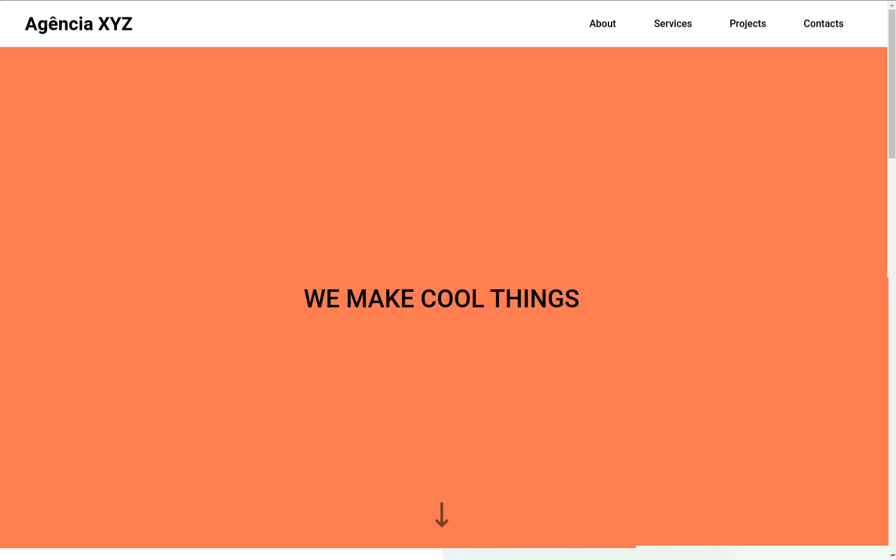
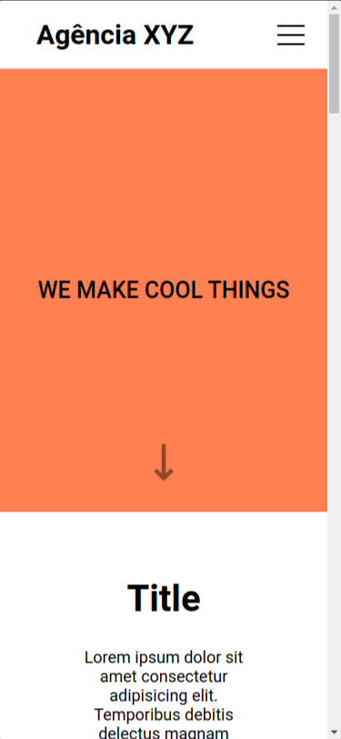

# Landing Page Com Grid Agencia xyz

This project was a lesson from the [Devquest](https://devemdobro.com/matriculas-abertas/) course.

## Table of contents

- [Overview](#overview)
  - [Screenshot](#screenshot)
  - [Links](#links)
- [My process](#my-process)
  - [Built with](#built-with)
  - [What I learned](#what-i-learned)
  - [Continued development](#continued-development)
  - [Useful resources](#useful-resources)
- [Author](#author)

## Overview

### Screenshot

### Links

- Live Site URL: [Live site URL here](https://otaviano-manoel.github.io/landing-page/)

## My process

### Built with

<code></code>
<code></code>

### What I learned

This lesson helped me better understand the application of `display: grid`, particularly in comparison to `display: flex`.

### Continued development

I will continue to develop myself through the course and by taking on challenges from [FrontEndMentor](https://www.frontendmentor.io/).

### Useful resources

- [W3Schools](https://www.w3schools.com/css/default.asp) - 
I used W3Schools to clarify my doubts and I really liked their examples, which clarify how to use CSS properties.

- [MDN Web Docs](https://developer.mozilla.org/pt-BR/) - I'd like you to get to know MDN Web Docs, which helped me a lot in understanding HTML tags.

## Author

- Frontend Mentor - [@Otaviano-Manoel](https://www.frontendmentor.io/profile/Otaviano-Manoel)